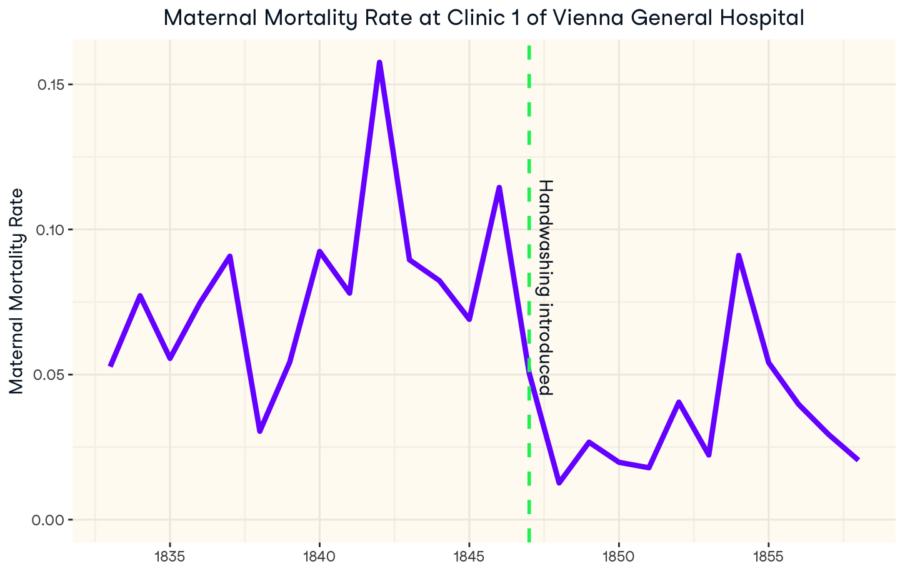

# The Discovery of Handwashing

In the mid 1800s, Dr. Ignaz Semmelweis was an obstetrician at Vienna General Hospital. At the time, maternal death due to puerperal fever was common, but he was particularly concerned that the death rate in his clinic (Clinic 1) was much higher than the death rate in another clinic at Vienna General Hospital (Clinic 2). So what was the difference between these two clinics? Doctors and midwives worked in Clinic 1, while only midwives worked in Clinic 2. This led Dr. Semmelweis to hypothesize that doctors carried deadly "cadaverous particles" from their autopsies to their patients in Clinic 2.

In 1847, Dr. Semmelweis instated a policy where doctors had to use a chlorine solution to wash their hands between performing autopsies and seeing patients. The maternal mortality rate drastically decreased as seen in the plot below. Sadly, germ theory (the idea that there are particles that cause disease) was not widely accepted at the time, so his hypothesis was rejected by most doctors.

The two datasets you will use are from Dr. Semmelweis's original 1859 publication1. Here are the details:

> ## datasets/clinic_data.csv
> This contains yearly clinic-level data on births and maternal deaths in each of the two maternity clinics at Vienna General Hospital. \
> 
> - **year**: each year from 1833 to 1858 
> - **births**: total number of births in the clinic 
> - **deaths**: number of maternal deaths in the clinic
> - **clinic**: clinic (either clinic_1 or clinic_2). Doctors and midwives worked in Clinic 1, while only midwives worked in Clinic 2.
> ## datasets/hospital_data.csv
>  This contains yearly hospital-level data on births and maternal deaths.
> - **year**: each year from 1784 to 1848
> - **births**: total number of births at the hospital
> - **deaths**: number of maternal deaths at the hospital
> - **hospital**: hospital (either Vienna or Dublin). At the Vienna - General Hospital where Dr. Semmelweis worked, doctors began performing pathological autopsies in 1823. At the Dublin Rotunda Hospital, doctors did not perform pathological autopsies at all.

1[1Ignaz Semmelweis: The etiology, concept, and prophylaxis of childbed fever.](http://graphics8.nytimes.com/images/blogs/freakonomics/pdf/the%20etiology,%20concept%20and%20prophylaxis%20of%20childbed%20fever.pdf)
